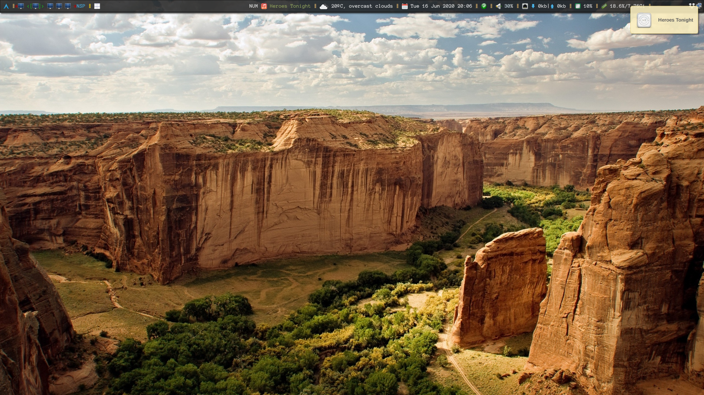
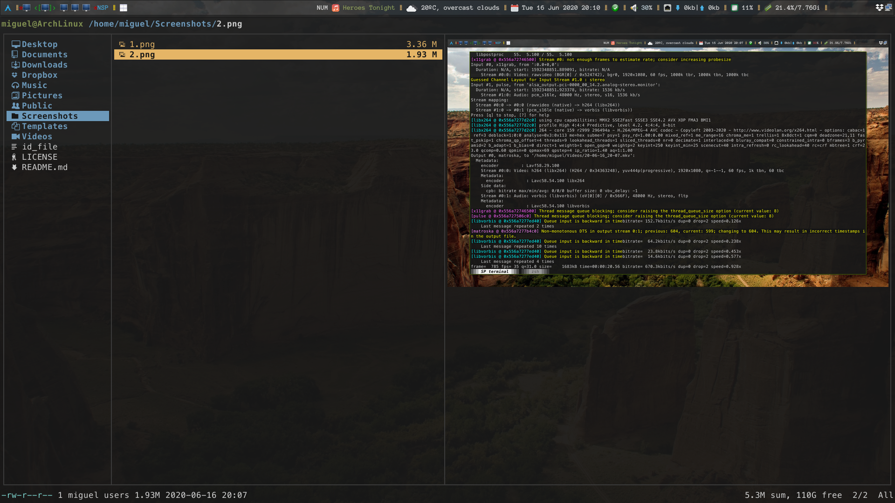
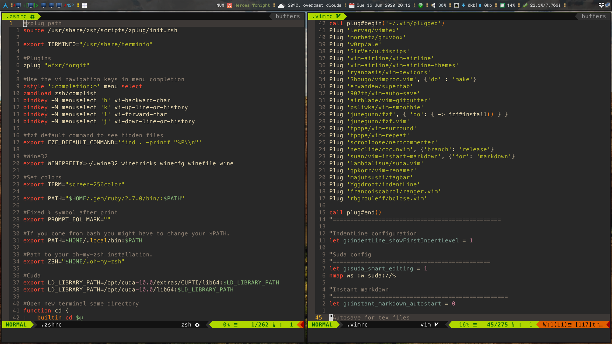

# DotFiles

My configuration files. 

# Screenshots

     

_You can get this wallpaper and more from here_

[Wallpaperscraft](wallpaperscraft.com)

# DotFiles management

**What Do I use to manage them?**

[Bare repositories](https://developer.atlassian.com/blog/2016/02/best-way-to-store-dotfiles-git-bare-repo/)
